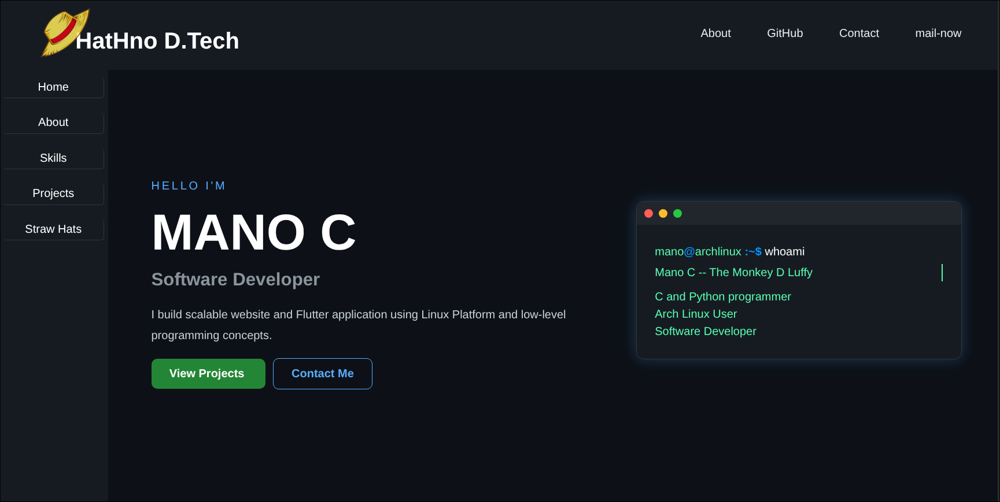

<div align="center">


# ⚡ HatHno D.Tech ⚡

### Modern Developer Portfolio • Linux • Python • Flutter • C

<p align="center">
  <a href="https://github.com/mano-sanjay">
    
  </a>

  

  

  
</p>

---

### 🚀 Futuristic Developer Portfolio Website

A modern cyber-style portfolio website designed and developed by **Mano C** using HTML, CSS and JavaScript.

Built with responsive layouts, animated UI effects, terminal-inspired design and interactive project showcases.

</div>

---

# 🌌 Live Experience

This portfolio includes:

- ✨ Animated Terminal Intro
- ✨ Responsive Sidebar Navigation
- ✨ Modern Dark UI
- ✨ Smooth Scrolling Sections
- ✨ Interactive Hover Effects
- ✨ Mobile Responsive Design
- ✨ Project Showcase Cards
- ✨ Contact & Social Integration
- ✨ Clean Developer Branding

---

# 🧠 About Me

I am **Mano C**, a software developer passionate about building:

- 🌐 Web Applications
- 📱 Flutter Mobile Apps
- ⚙️ Automation Scripts
- 🖥 Linux-Based Workflows
- 🔗 Networking Related Systems

I work with:

- C Programming
- Python
- Flutter
- FastAPI
- MySQL
- HTML/CSS/JavaScript
- Linux
- Git & GitHub

I enjoy creating efficient systems, exploring low-level concepts and turning ideas into real-world applications.

---

# 🛠 Tech Stack

<div align="center">

| Frontend | Backend | Mobile | System |
|---|---|---|---|
| HTML5 | FastAPI | Flutter | Linux |
| CSS3 | MySQL | Dart | Networking |
| JavaScript | Python | SQLite | Git |

</div>

---

# 📂 Project Structure

```bash
HatHno-D.Tech/
│
├── index.html
├── css/
│   └── style.css
│
├── js/
│   └── script.js
│
├── images/
│
├── README.md
├── LICENSE
└── favicon/
```

---

# 🚀 Featured Projects

## 🌐 Developer Portfolio

Modern responsive portfolio website with:

- terminal animation
- sidebar navigation
- futuristic UI
- mobile support

---

## 📊 Daily Route Analyzer

Offline productivity and route analysis application.

### Built Using:
- Flutter
- Python
- C Concepts

### Features:
- local data storage
- route analysis
- productivity tracking
- offline-first design

---

## 💰 Smart Expense Tracker

Offline expense management application.

### Features:
- spending analysis
- budget tracking
- local device storage
- fast lightweight performance

---

# ✨ UI Features

- ✅ Animated Hover Effects
- ✅ Gradient Borders
- ✅ Interactive Sidebar
- ✅ Responsive Layout
- ✅ Smooth Navigation
- ✅ Terminal Styled Interface
- ✅ Dark Theme Design
- ✅ Mobile Optimization

---

# 🔥 Future Goals

- AI integration
- Full backend system
- Authentication
- Deployment server
- Analytics dashboard
- API integrations
- Advanced animations

---

# 🌍 SEO Keywords

developer portfolio, Mano C portfolio, HatHno D.Tech, frontend developer portfolio, modern portfolio website, responsive portfolio, HTML CSS JavaScript portfolio, Linux portfolio website, Flutter developer portfolio, Python developer portfolio, cyber security portfolio, software developer portfolio

---

# 📸 Screenshots



---

# ⚙️ Installation

### Clone the repository:

```bash
git clone https://github.com/mano-sanjay/mano-portfolio.git
```

### Open the project:

```bash
cd mano-portfolio
```

### Run:

Open `index.html` in browser

---

# 📬 Contact

## 📧 Email

manosanjaymano@gmail.com

## 💻 GitHub

https://github.com/mano-sanjay

## 📱 WhatsApp

https://wa.me/919150788702

---

# ⭐ Support The Project

If you like this project:

- ⭐ Star the repository
- 🍴 Fork the repository
- 🚀 Share with others

---

<div align="center">

⚡ “Code. Build. Learn. Repeat.” ⚡

Built with passion by Mano C

</div>